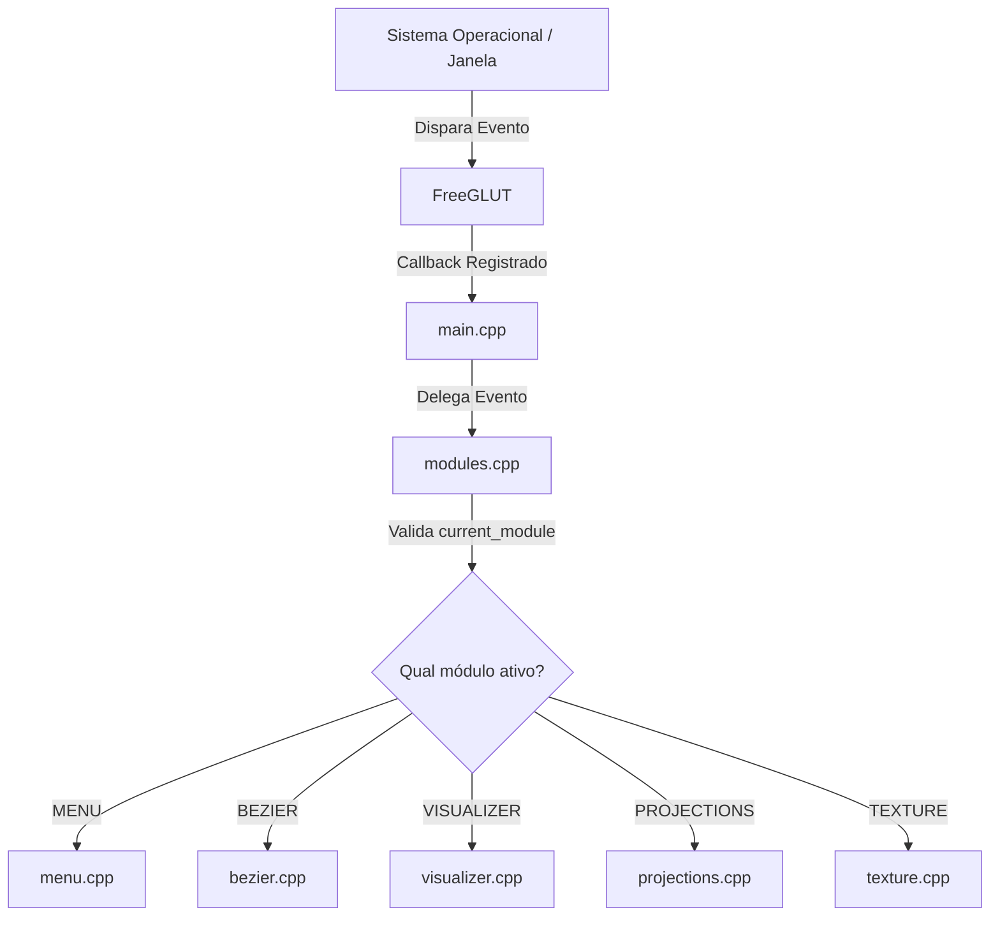

# Arquitetura do Sistema e Funcionamento do OpenGL por Trás

Este documento fornece uma análise profunda da **arquitetura do simulador** e de como a **API OpenGL** (na sua versão de pipeline clássico/fixo) opera sob o capô para coordenar e renderizar as diferentes telas interativas do projeto.

---

## 🏗️ 1. Composição e Arquitetura de Módulos

O projeto adota uma arquitetura estruturada em **Máquina de Estados de Callback Delegada**. Como o FreeGLUT gerencia a janela do sistema operacional e é single-threaded, todos os inputs e eventos de desenho precisam fluir por uma central de distribuição antes de chegarem à tela ativa.

### O Fluxo de Controle e Eventos

Abaixo está o diagrama de fluxo que ilustra como uma entrada do usuário ou solicitação de desenho é roteada no sistema:



### Acoplamento e Encapsulamento

Cada submódulo (Bezier, Visualizer, etc.) é projetado como uma unidade independente que implementa funções com assinaturas equivalentes aos callbacks do GLUT. Por exemplo, o módulo `visualizer.cpp` encapsula:
* `visualizer_display()`: Desenho específico da cena 2D/3D.
* `visualizer_mouse()`, `visualizer_motion()`, `visualizer_passive_motion()`: Lógica local de interação física.
* `visualizer_keyboard()`, `visualizer_keyboard_up()`: Rastreamento do estado de teclas locais.
* `visualizer_update()`: Loop físico disparado pelo temporizador do sistema.

Essa abordagem garante que as variáveis internas de simulação (como ângulos de rotação de câmera, vetores de luz local, etc.) fiquem declaradas como `static` em cada arquivo `.cpp`, evitando conflitos de escopo e minimizando o uso de variáveis globais compartilhadas.

### Gerenciamento de Resolução e Aspect Ratio (Letterboxing)

Um desafio comum em computação gráfica é evitar que o redimensionamento da janela deforme a imagem (achatando ou esticando objetos). O simulador resolve isso no `reshape_callback` de [modules.cpp](file:///C:/Users/yagog/Documents/coding/comp-grafic/opengl_visualizer/src/modules.cpp) através do algoritmo de **Letterboxing / Pillarboxing**:

1. **Definição da Proporção Ideal:** A proporção alvo é fixada em $16:9$ ($1.7778$).
2. **Cálculo da Janela Real:** A largura e altura reais da janela física são divididas para obter `window_aspect_ratio`.
3. **Ajuste de Viewport:**
   * Se a janela for mais larga que a proporção ideal (telas UltraWide, por exemplo), o sistema adiciona barras pretas nas laterais (**Pillarbox**). Ele fixa a altura da imagem (`viewport_height = height`), calcula a largura ideal (`width = height * 1.7778`) e desloca horizontalmente a área de desenho via `viewport_x = (width_real - width_ideal) / 2`.
   * Se a janela for mais alta (monitores no modo retrato ou janelas quadradas), são adicionadas barras pretas em cima e embaixo (**Letterbox**). Ele fixa a largura ideal e calcula o deslocamento vertical `viewport_y`.
4. **Chamada de Viewport:** A função `glViewport(viewport_x, viewport_y, viewport_width, viewport_height)` delimita fisicamente onde o rasterizador de pixels do OpenGL pode desenhar na janela do SO.

---

## ⚙️ 2. Como o OpenGL Funciona por Trás (O Pipeline Clássico)

O simulador é construído sobre o **Pipeline de Função Fixa** do OpenGL (OpenGL 1.x a 2.x). Nessa modalidade, o hardware gráfico (GPU) opera como uma **máquina de estados global** altamente otimizada, e os desenvolvedores configuram os comportamentos ligando ou desligando parâmetros específicos em vez de programar shaders de vértices e fragmentos manualmente.

Abaixo, detalhamos os principais pilares do funcionamento do OpenGL dentro do nosso código:

### A. A Máquina de Estados Global do OpenGL
O OpenGL mantém um estado persistente. Sempre que chamamos funções de ativação, o estado é mantido até que seja explicitamente desativado. 

No projeto, isso é crucial para evitar que as configurações de uma tela interfiram em outra:
* `glEnable(GL_DEPTH_TEST)`: Ativa o teste de profundidade (*Z-buffer*). Essencial nas telas 3D para que faces traseiras não fiquem sobrepostas sobre as frontais. É desabilitado em menus e desenhos 2D para otimizar a performance e garantir renderizações ordenadas de botões.
* `glEnable(GL_LIGHTING)`: Habilita a iluminação local. Quando ativo, o OpenGL desconsidera as chamadas diretas de cores `glColor3f` nas geometrias e passa a calcular a cor do pixel através da fórmula matemática de reflexão de luz.
* `glEnable(GL_TEXTURE_2D)`: Ativa o mapeamento de texturas. Se for mantido ativo ao desenhar formas sólidas simples (como no visualizador), o OpenGL tentará buscar texturas inexistentes, gerando superfícies brancas ou corrompidas. Por isso, ele é cuidadosamente ligado e desligado antes e depois de cada bloco de desenho específico de textura.

---

### B. O Pipeline Geométrico e o Sistema de Matrizes

Em computação gráfica, os vértices de um objeto passam por várias transformações matemáticas antes de virarem pixels na tela:

```
[Vértices Locais] 
       | (Matriz ModelView - Translação/Rotação do Objeto e Câmera)
       v
[Coordenadas de Câmera (Eye Space)]
       | (Matriz de Projeção - Perspectiva ou Ortográfica)
       v
[Coordenadas de Recorte (Clip Space)]
       | (Divisão de Perspectiva)
       v
[Coordenadas de Dispositivo Normalizadas - NDC (-1 a +1)]
       | (Transformação de Viewport)
       v
[Pixels da Janela (Screen Space)]
```

O OpenGL gerencia isso mantendo **pilhas de matrizes** de transformação separadas. As duas principais pilhas configuradas no projeto são:

#### 1. Matriz de Projeção (`GL_PROJECTION`)
Define o "lente" da câmera e a geometria do volume de visualização (o que é visível e o que é descartado por estar muito perto ou muito longe).
* **Projeção Ortográfica (`glOrtho` ou `gluOrtho2D`):** Usada no menu, na tela de curvas de Bézier e nos painéis 2D. Ela projeta os pontos em linhas paralelas. O volume de corte é um paralelepípedo reto. O tamanho de um objeto na tela independe de sua distância em relação à câmera (ideal para UIs e desenhos técnicos).
* **Projeção Perspectiva (`gluPerspective`):** Usada para visualização 3D realista. O volume de visualização é um tronco de pirâmide (**frustum**). Objetos mais distantes são projetados menores devido à convergência das linhas em direção ao ponto de fuga.
  ```cpp
  gluPerspective(fovy, aspect, zNear, zFar);
  ```
  * `fovy` (Field of View Y): Ângulo de abertura vertical da lente da câmera (em graus).
  * `aspect`: Proporção horizontal/vertical.
  * `zNear` e `zFar`: Planos de corte frontal e traseiro. Nada mais perto que `zNear` ou mais distante que `zFar` é renderizado.

#### 2. Matriz ModelView (`GL_MODELVIEW`)
Combina a posição da câmera (visualização) com a posição/rotação/escala dos objetos (modelagem).
* **Posicionando a Câmera (`gluLookAt`):**
  Define a matriz de visualização. É como se movêssemos todo o mundo na direção contrária para simular a câmera física.
  ```cpp
  gluLookAt(eyeX, eyeY, eyeZ,  centerX, centerY, centerZ,  upX, upY, upZ);
  ```
  * `eye`: Posição física do olho da câmera no espaço 3D.
  * `center`: Ponto no espaço 3D para onde a câmera está "olhando".
  * `up`: Vetor que indica a orientação "para cima" da câmera (geralmente `[0, 1, 0]`).
* **Transformações Geométricas Locais:**
  * `glTranslatef(dx, dy, dz)`: Translada a origem do sistema de coordenadas local.
  * `glRotatef(angle, x, y, z)`: Rotaciona o sistema de coordenadas em torno de um vetor.
  * `glScalef(sx, sy, sz)`: Altera a escala dimensional dos eixos.

#### 3. Isolando Transformações com a Pilha de Matrizes (`glPushMatrix` / `glPopMatrix`)
Como as matrizes se multiplicam acumulando seus efeitos, desenhar múltiplos objetos em locais diferentes sem que um afete a posição do outro exige o uso da pilha:
```cpp
glPushMatrix(); // Salva o estado atual da matriz na pilha
  glTranslatef(obj_x, obj_y, obj_z); // Aplica transformações locais apenas a este objeto
  glRotatef(rot, 0, 1, 0);
  desenhar_objeto_A();
glPopMatrix();  // Restaura o estado anterior da matriz. O efeito de translação/rotação do objeto A é descartado

glPushMatrix(); // Inicia um novo espaço para o objeto B
  glTranslatef(outros_valores_x, y, z);
  desenhar_objeto_B();
glPopMatrix();
```

#### 4. Mudança de Base e Matrizes Customizadas
No arquivo [projections.cpp](file:///C:/Users/yagog/Documents/coding/comp-grafic/opengl_visualizer/src/projections.cpp), precisamos desenhar o frustum translúcido da câmera sob o mesmo ângulo de visão dela. Para fazer isso de forma direta, o código calcula os vetores de base da câmera ($\vec{Forward}$, $\vec{Right}$, $\vec{Up}$) e constrói uma **Matriz de Rotação Homogênea** customizada:
```cpp
float rot_matrix[16] = {
     sX,  sY,  sZ, 0.0f, // Vetor lateral (Right)
     uX,  uY,  uZ, 0.0f, // Vetor vertical local (Up)
    -fX, -fY, -fZ, 0.0f, // Vetor de profundidade invertido (-Forward)
    0.0f,0.0f,0.0f, 1.0f 
};
```
Esta matriz é injetada no pipeline através de `glMultMatrixf(rot_matrix)`. Ela faz a transposição dos eixos locais da câmera para o sistema de coordenadas globais, permitindo desenhar retas convergentes no espaço visual sem precisar calcular manualmente a trigonometria de cada rotação.

---

### C. Processamento de Primitivas e Vértices

No OpenGL clássico, a geometria é delimitada pelas chamadas `glBegin` e `glEnd`.
As primitivas determinam como os vértices são conectados pelo rasterizador:

| Primitiva | Modo de Desenho | Uso no Simulador |
| :--- | :--- | :--- |
| `GL_POINTS` | Trata cada vértice como um pixel ou ponto isolado. | Ponto 2D no Visualizador. |
| `GL_LINES` | Conecta cada par de vértices consecutivo como linhas individuais. | Polígono de controle das curvas de Bézier; eixos coordenados. |
| `GL_LINE_STRIP` | Conecta vértices de forma sequencial em uma linha contínua. | Traçado da Curva de Bézier; contorno do círculo. |
| `GL_LINE_LOOP` | Igual ao strip, mas conecta o último vértice de volta ao primeiro. | Bordas de contêineres e painéis da interface. |
| `GL_QUADS` | Agrupa conjuntos de 4 vértices para formar quadriláteros preenchidos. | Renderização das faces do cubo texturizado; botões do menu. |
| `GL_TRIANGLE_FAN` | Desenha triângulos que compartilham o primeiro vértice (em leque). | Desenho de círculos 2D preenchidos na tela. |

#### Atributos de Vértice e Iluminação (Normais de Superfície)
Ao renderizar um sólido, cada vértice é acompanhado por propriedades geométricas específicas:
1. `glTexCoord2f(u, v)`: Informa a coordenada de textura para o vértice subsequente.
2. `glNormal3f(nx, ny, nz)`: Define o vetor perpendicular à face (vetor normal) associado àquele vértice.

> [!IMPORTANT]
> **Por que as Normais (`glNormal`) são cruciais?**
> A iluminação local em 3D depende essencialmente das normais de superfície. O cálculo matemático de iluminação da GPU compara a direção das normais de cada face com a direção de incidência dos raios de luz. Se a normal não estiver configurada corretamente, o objeto não receberá sombreamento (ficará totalmente plano ou uniformemente iluminado), impossibilitando a visualização de profundidade.

---

### D. Iluminação e Materiais (Modelo de Phong)

A renderização 3D realista no simulador utiliza o **Modelo de Reflexão Local de Phong**. Ele calcula a cor final de cada pixel com base na soma de três componentes distintas de luz e nas propriedades de reflexão do material do objeto:

$$Cor_{final} = Cor_{Ambiente} + Cor_{Difusa} + Cor_{Especular}$$

```
    Luz Direta                     Reflexão Especular (Brilho)
      \                                  ^
       \      Normal de Superfície      /
        \              |               /
         v             |              /
       =======-------- o --------========
                    Superfície
```

#### 1. Componente Ambiente
Simula a luz indireta que rebateu em várias superfícies na cena real antes de atingir o objeto. É uma iluminação global constante e uniforme que incide sob todos os ângulos:
$$\text{Luz Ambiente} = \text{Luz}_{AmbientIntensity} \times \text{Material}_{AmbientReflectance}$$

#### 2. Componente Difusa (Espalhamento Lambertiano)
Simula a luz que atinge a superfície e é refletida de forma igualitária em todas as direções. A intensidade depende do cosseno do ângulo entre o vetor da luz ($\vec{L}$) e o vetor normal da superfície ($\vec{N}$):
$$\text{Luz Difusa} = \text{Luz}_{DiffuseIntensity} \times \text{Material}_{DiffuseReflectance} \times (\vec{N} \cdot \vec{L})$$
Se a luz atinge a superfície de forma perpendicular ($\vec{N} \cdot \vec{L} = 1$), a iluminação é máxima. Se incidir de forma tangente ($\vec{N} \cdot \vec{L} = 0$), a componente difusa é zero.

#### 3. Componente Especular (Brilho Metálico / Plástico)
Representa a reflexão direta da luz na direção dos olhos do observador. Cria o "ponto de brilho" característico em superfícies polidas. Depende do ângulo entre a direção de visão do observador ($\vec{V}$) e a direção de reflexão perfeita do raio de luz ($\vec{R}$):
$$\text{Luz Especular} = \text{Luz}_{SpecularIntensity} \times \text{Material}_{SpecularReflectance} \times (\vec{R} \cdot \vec{V})^{n}$$
O expoente $n$ é o valor de **Shininess** (brilho do material, configurado via `GL_SHININESS` no código):
* Um $n$ pequeno (ex: 5.0) gera um brilho grande e espalhado (como plástico fosco ou madeira envernizada).
* Um $n$ grande (ex: 100.0) gera um ponto de brilho pequeno e extremamente concentrado (característico de metais altamente polidos ou espelhos).

---

### E. Mapeamento de Texturas e Geração Automática (`TexGen`)

Para aplicar imagens 2D sobre objetos 3D, precisamos mapear pixels da imagem (chamados de *texels*) às coordenadas espaciais do modelo tridimensional.

#### 1. Filtros de Textura (Minificação e Magnificação)
Como uma imagem de textura tem tamanho fixo em pixels (por exemplo, uma grade de $512\times 512$), e a representação do cubo na tela muda de tamanho dependendo da distância da câmera, o OpenGL precisa resolver a amostragem de cores:
* `GL_TEXTURE_MAG_FILTER` (Magnificação): Quando o objeto está muito perto e a textura precisa ser esticada na tela.
* `GL_TEXTURE_MIN_FILTER` (Minificação): Quando o objeto está muito distante e muitos texels concorrem para representar um único pixel físico na tela.

O projeto configura estes filtros em [utils.cpp](file:///C:/Users/yagog/Documents/coding/comp-grafic/opengl_visualizer/src/utils.cpp) como `GL_LINEAR` (Interpolação Bilinear). Isso instrui a placa de vídeo a misturar as cores dos 4 pixels vizinhos mais próximos da textura, proporcionando um aspecto visual suave e evitando o visual serrilhado/quadriculado (*pixelado*) que ocorreria se usássemos `GL_NEAREST`.

#### 2. Geração de Coordenadas Procedural via `GL_OBJECT_LINEAR`
Objetos como a Esfera (`glutSolidSphere`), o Toro (`glutSolidTorus`) e o Cone (`glutSolidCone`) gerados nativamente pelo FreeGLUT não fornecem coordenadas de mapeamento UV automaticamente.

Para aplicar texturas sobre essas formas geométricas no [visualizer.cpp](file:///C:/Users/yagog/Documents/coding/comp-grafic/opengl_visualizer/src/visualizer.cpp), ativamos o recurso de geração automática de coordenadas de textura do OpenGL:
```cpp
glEnable(GL_TEXTURE_GEN_S);
glEnable(GL_TEXTURE_GEN_T);
glTexGeni(GL_S, GL_TEXTURE_GEN_MODE, GL_OBJECT_LINEAR);
glTexGeni(GL_T, GL_TEXTURE_GEN_MODE, GL_OBJECT_LINEAR);
```
O modo `GL_OBJECT_LINEAR` calcula a coordenada horizontal $U$ (denotada por $S$ em OpenGL) e vertical $V$ (denotada por $T$) com base nas coordenadas de vértice $X, Y, Z$ de modelo do objeto original usando planos de projeção linear:

$$S = g_1 \cdot X + g_2 \cdot Y + g_3 \cdot Z + g_4 \cdot W$$

Definimos os vetores planos de projeção `s_plane` e `t_plane` da seguinte forma:
```cpp
GLfloat s_plane[] = { 1.0f / obj_3d_size, 0.0f, 0.0f, 0.0f };
GLfloat t_plane[] = { 0.0f, 1.0f / obj_3d_size, 0.0f, 0.0f };
```
Dessa forma, a coordenada de textura $S$ avança proporcionalmente ao eixo X do objeto, e a coordenada $T$ acompanha o eixo Y, gerando uma projeção ortogonal perfeita da imagem da textura sobre os vértices do modelo geométrico, ajustando a escala automaticamente à medida que alteramos o parâmetro de tamanho do objeto.

---

### F. Transparência e Mistura de Cores (Blending)

Para simular materiais translúcidos (como o vidro ou os planos do frustum visual na tela de projeções), o pipeline de renderização precisa ser modificado para não sobrescrever os pixels que já estão no buffer da tela.

```cpp
glEnable(GL_BLEND);
glBlendFunc(GL_SRC_ALPHA, GL_ONE_MINUS_SRC_ALPHA);
glDepthMask(GL_FALSE);
// ... desenha superfícies transparentes ...
glDepthMask(GL_TRUE);
glDisable(GL_BLEND);
```

#### 1. A Equação de Mistura (Blending Equation)
A chamada `glBlendFunc(GL_SRC_ALPHA, GL_ONE_MINUS_SRC_ALPHA)` configura a equação matemática de mistura linear. O pixel final que será exibido no monitor é calculado da seguinte forma:

$$Cor_{final} = (Cor_{Origem} \times Alfa_{Origem}) + (Cor_{Destino} \times (1 - Alfa_{Origem}))$$

* **$Cor_{Origem}$ (Source):** A cor do novo polígono translúcido que estamos tentando desenhar agora.
* **$Cor_{Destino}$ (Destination):** A cor que já está desenhada na tela naquele pixel (o fundo ou objetos que já foram renderizados anteriormente).
* **$Alfa_{Origem}$:** A propriedade de transparência (canal A de RGBA) do novo polígono, variando de `0.0f` (totalmente transparente) a `1.0f` (totalmente opaco).

#### 2. O Papel do Depth Mask (`glDepthMask`)
Em OpenGL, o buffer de profundidade (*Z-buffer*) rastreia a distância física dos objetos renderizados para garantir que objetos mais distantes não sobrescrevam objetos que estão na frente.

No entanto, se desenharmos um plano translúcido e ele gravar seu valor de proximidade no *Z-buffer*, qualquer objeto desenhado depois ficará oculto (mesmo que o plano seja quase transparente), gerando furos visuais e falhas de renderização.

Para contornar isso, usamos `glDepthMask(GL_FALSE)`. Isso avisa ao OpenGL para **desativar a gravação no Z-buffer** temporariamente durante o desenho dos elementos transparentes. As cores são misturadas fisicamente no buffer de pixels, mas os valores de distância espacial não são alterados, permitindo que todas as geometrias internas do frustum sejam renderizadas corretamente sem recortes indevidos.

---

### G. Avaliação Matemática de Curvas por Hardware (`glMap1f`)

No módulo [bezier.cpp](file:///C:/Users/yagog/Documents/coding/comp-grafic/opengl_visualizer/src/bezier.cpp), em vez de criar uma rotina para computar os polinômios de Bernstein da curva de Bézier de terceiro grau:

$$B(t) = (1-t)^3 P_0 + 3(1-t)^2 t P_1 + 3(1-t) t^2 P_2 + t^3 P_3$$

Utilizamos os **Avaliadores Unidimensionais do OpenGL**:
```cpp
glMap1f(GL_MAP1_VERTEX_3, 0.0, 1.0, 3, 4, &control_points[0][0]);
glEnable(GL_MAP1_VERTEX_3);
```
O compilador gráfico do OpenGL recebe os quatro pontos de controle tridimensionais diretamente na memória da placa gráfica. Quando chamamos `glEvalCoord1f(t)` em um loop variando $t$ de `0.0f` a `1.0f`, a GPU calcula a fórmula polinomial de Bernstein internamente e gera o vértice tridimensional correspondente de forma direta e paralela no hardware, enviando o vértice diretamente para a fase de rasterização. Isso economiza chamadas de CPU e demonstra o suporte nativo do pipeline clássico para curvas paramétricas e superfícies curvas (NURBS).
